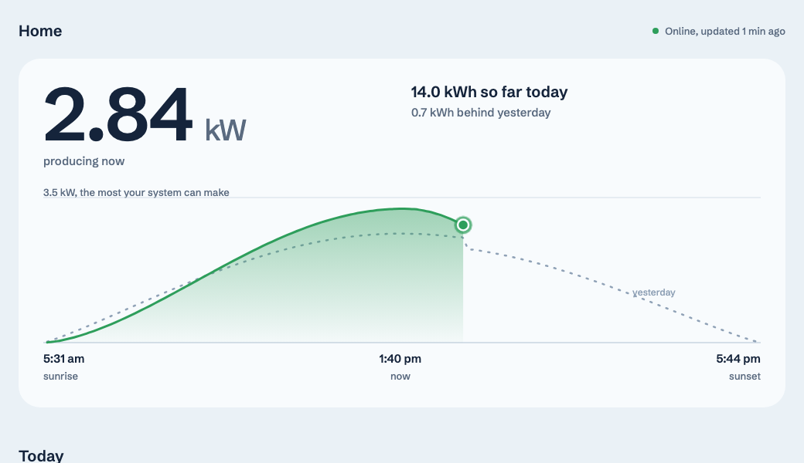

# solar-dash

A simple, self-hosted dashboard for **WAAREE PV Hub** solar accounts. WAAREE
uses the **FoxESS Cloud** API, so the dashboard should also work with other
FoxESS-branded accounts. It brings live production, daily comparisons, a
calendar, and a year of history together on one page. You can also install it
on your phone as a PWA.

It runs as a Cloudflare Worker, so there's no server to maintain. A password
protects the dashboard, and a single-plant setup fits within Cloudflare's free
tier.



## Why this exists

I built this because the WAAREE app made it harder than it should be to check
current production or look back at earlier days. This dashboard uses the same
API and puts that information on one page.

You can see live production, today's curve against the weather forecast and
a clear-sky day (or as hourly bars), any past day, monthly and yearly totals,
inverter status, and today's alarms.

Home usage, grid import/export, and battery state depend on your installation
having an energy meter. WAAREE's API reports these values only when a meter is
present; without one, `loadsPower` and `gridConsumptionPower` are always zero.
The dashboard checks `has_meter` and hides the figures when there is no meter.
If your installation has one, the figures appear as usual.

## How it works

```
Cron (every 5 min) ──▶ WAAREE Cloud API ──▶ Cloudflare KV (cached state)
                                                     │
Browser ──▶ Worker (password gate) ──▶ /api/state ──┘
                    │
                    └─▶ static UI (HTML/CSS/JS, no framework, no build step)
```

- A scheduled Worker polls WAAREE every 5 minutes and saves the result in
  Workers KV.
- `GET /api/state` returns the cached state, so loading the page doesn't have
  to wait for a live request to WAAREE.
- `GET /api/day` and `GET /api/month` fetch a specific past day or month on
  demand for the calendar. They reuse the session token and cache completed
  days and months in KV, avoiding repeat requests to WAAREE.
- A password protects the app at `/login`. Sessions use an HMAC-signed cookie,
  and login attempts are rate-limited so the dashboard can be accessed safely
  outside your home network.
- The interface is a static page with no framework or build step. It includes
  a small embedded font subset and can be installed on a phone as a PWA.

## Requirements

- A WAAREE PV Hub account (or another FoxESS-white-label account) with at
  least one plant.
- A [Cloudflare](https://cloudflare.com) account (the free tier is enough —
  see [Costs](#costs) below).
- Node.js 20+ and `npm`.

**Region:** WAAREE is available in India, and the dashboard uses `Asia/Kolkata`
(UTC+5:30) to define "today" and "this month." Currency is shown in INR. To
adapt it for a FoxESS-branded service elsewhere, update the `TZ_OFFSET_MIN`
handling in `src/mapping.ts` (some values are still the literal `330`) and the
`en-IN`/`INR` formatting in `web/index.html`.

## Setup

```bash
git clone <this repo>
cd solar-dash
npm install
npx wrangler login        # opens a browser to authorize Cloudflare
scripts/setup.sh          # creates your KV namespace, patches wrangler.jsonc
scripts/set-secrets.sh    # prompts for WAAREE + dashboard credentials
npm run deploy
```

`scripts/set-secrets.sh` asks for:

| Secret | What it is |
|---|---|
| `WAAREE_USERNAME` | Your WAAREE login username |
| `WAAREE_PASSWORD_MD5` | Computed locally from your password (the script hashes it — your plaintext password is never sent to Cloudflare or written to disk) |
| `DASH_PASSWORD` | The password *you* pick to view the dashboard itself |
| `SESSION_SECRET` | Random, generated for you (`openssl rand -hex 32`) |

None of these are ever written to a file in this repo or committed —
they're pushed straight to Cloudflare as encrypted Worker secrets.

Set your plant's coordinates in `wrangler.jsonc` (`LAT`/`LON`) so the
sunrise/sunset times and the weather forecast are accurate. They default to
New Delhi's, which will be wrong for you.

Also in `wrangler.jsonc`:

| Var | What it's for |
| --- | --- |
| `PANEL_COUNT`, `PANEL_W` | Your panels, e.g. `6` × `585`. WAAREE only stores a rounded plant size. Leave `""` to use WAAREE's. |
| `INVERTER_KW` | The inverter's AC rating, e.g. `3.3`. This is the ceiling on the charts. |
| `TILT`, `AZIMUTH` | Panel angle from flat, and direction (`0` south, `-90` east, `90` west). Used by the forecast. |
| `FORECAST` | `"0"` turns the weather forecast off. |

### Weather forecast

Once an hour the poller fetches a 15-minute irradiance forecast for your
panels' angle from [Open-Meteo](https://open-meteo.com) (free for
non-commercial use, no API key). It turns that into expected output using
your panel size, a temperature correction, and a performance ratio learned
from what your plant actually made over the past week. The inverter limit
caps the result. A clear-sky curve is computed locally for comparison. The
browser never contacts Open-Meteo; the forecast is stored with the rest of
the state in KV.

### Custom domain (optional)

By default, the dashboard is available at
`https://solar-dash.<your-subdomain>.workers.dev`. To use your own domain, its
DNS zone must be on the same Cloudflare account. Add your domain in the
`routes` block in `wrangler.jsonc`, then redeploy.

### Local development

```bash
cp .dev.vars.example .dev.vars   # fill in your own values, or leave MOCK=1
npm run dev
```

Set `MOCK=1` in `.dev.vars` to use the bundled sample data without a WAAREE
account. Choose a fixture with `MOCK_SCENARIO` (`design` or `night`), and set
`MOCK_NOW=YYYY-MM-DDTHH:MM` to control the simulated time.

## Project layout

```
src/            Worker source (TypeScript)
  index.ts        entrypoint: auth gate, routing, the scheduled poll
  client.ts        WAAREE API client (login, signed requests, retry-on-expiry)
  poll.ts          the 5-minute cron poll → cached state in KV
  history.ts       on-demand /api/day and /api/month (calendar drill-down)
  mapping.ts       WAAREE's raw API shapes → this app's data model
  mock.ts          MOCK=1 fixture-backed responses for local dev
  sun.ts           sunrise/sunset (NOAA approximation)
  forecast.ts      Open-Meteo forecast, clear-sky model, self-calibration
  auth.ts          password gate: session cookies, rate limiting
web/            The UI you actually edit (plain HTML/CSS/JS, no build step)
public/         Built output of web/ (generated by `npm run sync-assets`,
                git-ignored — don't edit these directly)
test/           Vitest unit tests
scripts/        One-time setup + secret management (run these yourself)
```

## Costs

For one plant and personal use, the dashboard fits within Cloudflare's free
tier:

- **Workers**: cron runs every 5 min (~8,640/month) plus page loads — well
  under the free tier's 100,000 requests/day.
- **Workers KV**: the cron poll saves state every 5 minutes, plus a few
  refresh timestamps (history, yesterday, forecast) and the session token on
  re-login. That comes to roughly 430 writes a day, under the free tier's
  1,000. Reads are unmetered on the free
  tier up to 100,000/day.

For multiple plants or many viewers, check your usage against Cloudflare's
current Workers and KV limits.

## Security notes

- Everyone who uses the dashboard shares one password; there are no
  individual accounts. Keep the password private.
- Repeated failed attempts at `/login` cause that IP to be rate-limited.
- WAAREE allows one active session per account. A new login invalidates the
  previous one, so running `npm run dev` with your real credentials while the
  deployed Worker is active will cause the two sessions to log each other
  out.

## License

MIT — see [LICENSE](LICENSE).

This project is not affiliated with, endorsed by, or supported by WAAREE
or FoxESS. It's an independent client for their public API, built by
reverse-engineering the official Android app's network traffic.
